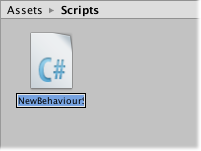

# From Web to Game Developer

**Learn Unity through best practices**

Giorgio Pomettini ([@pomettini](https://github.com/pomettini))

---

# Who am I

- Been using Unity since 2013
- Worked on several companies and startups as a Unity dev
- Lead developer on [Fury Roads Survivor](http://www.furyroadssurvivor.com/) (6M+] downloads)
- Programmer on [Blankos Block Party](https://blankos.com/) (shown at E3)
- Now working as a freelancer and teacher

---

# Who is this talk for

- I've opened Unity and I didn't know where to start
- I've followed a tutorial but it didn't help
- I've followed an online course but I'm still confused
- What do I need to do to make a game?

---

# Let's start from scratch

- Unity's interface
- Overview of scripting in C#
- Common mistakes
- Best practices
- Where to look for help
- Where to learn more

---

# Interface

---

# Wait, what is is a GameObject?

---

# Scripting

- Unity supports the C# programming language
- C# is a garbage collected, strongly typed, object-oriented language
- It's somewhat similar to Java or C++ (minus the pointers)
- Let's create our first script by going to **Assets > Create > C# Script**
- The new script will be created in whichever folder you have selected in the Project panel



---

# Anatomy of a Script file

```csharp
using UnityEngine;
using System.Collections;

public class MyScript : MonoBehaviour {

    // Use this for initialization
    void Start () {

    }

    // Update is called once per frame
    void Update () {

    }
}
```

---

# Wait, what is a MonoBehaviour?

---

# Variables and the Inspector

- When creating a script, you are essentially creating your own new type of component that can be attached to GameObjects just like any other component
- Just like other Components often have properties that are editable in the inspector, you can allow values in your script to be edited from the Inspector too

---

# Variables and the Inspector

```csharp
using UnityEngine;
using System.Collections;

public class MainPlayer : MonoBehaviour
{
    public string myName;

    // Use this for initialization
    void Start ()
    {
        Debug.Log("I am alive and my name is " + myName);
    }
}
```

---

# Common mistakes

---

# Best practices

---

# Where to look for help

---

# Useful resources

---

# Thank you
