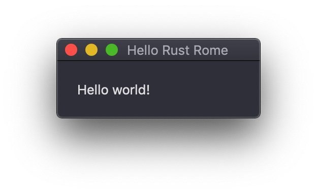
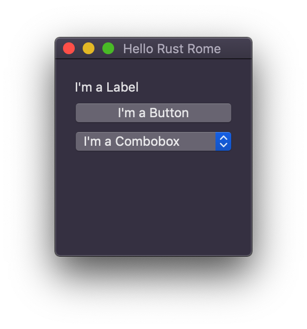
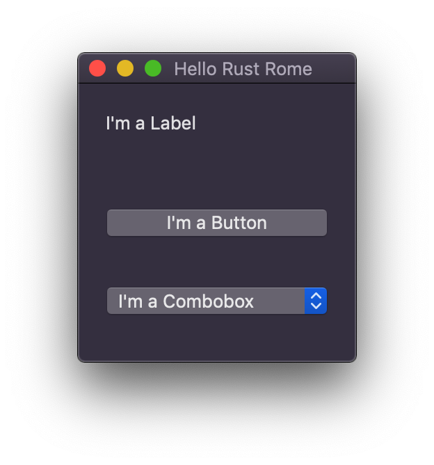
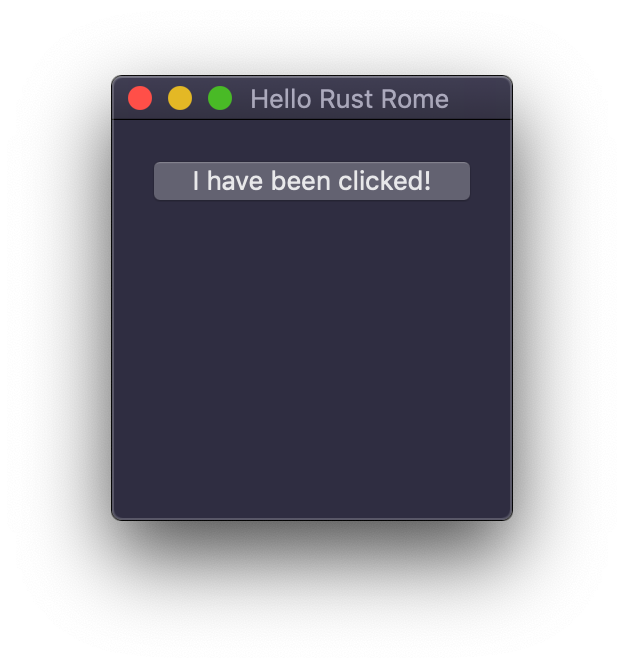
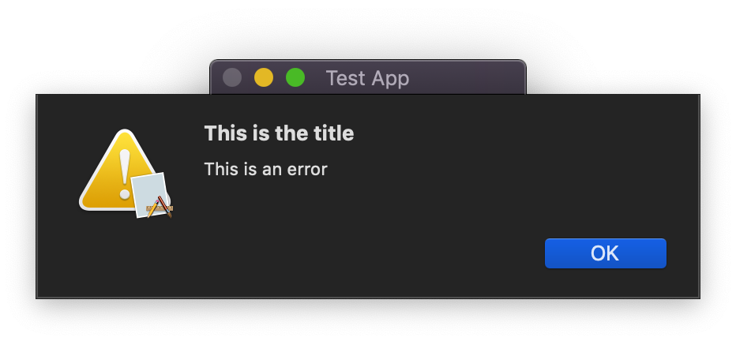
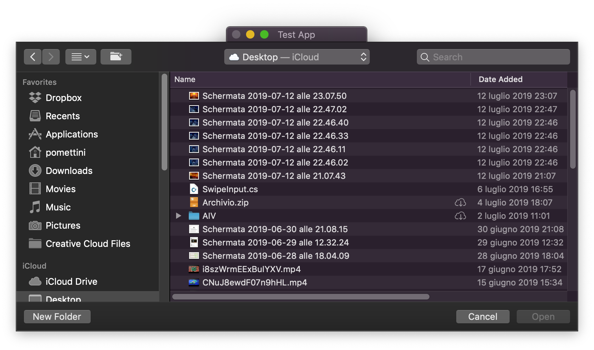

<!-- $size: A3 -->

# Getting started with cross-platform UI in Rust

##### Discovering `libui-rs`, a simple and portable cross-platform UI that doesn't suck

###### Giorgio Pomettini ([@pomettini](https://github.com/pomettini))

---

# What we're going to have today

- Why using `libui` as a cross-platform GUI library
- How to use the `libui-rs` library
- Have a look at every UI control
- Write an example project
- How to test a GUI application
- What is currently missing

---

# Why using `libui` as a cross-platform GUI library

##### Or: why are you not using `QT` like everyone sane human?

---

# Why using `libui` as a cross-platform GUI library

- `QT` is great but...
- If you want to statically link the DLL you have to get a license
- Or you have to bundle your app with a `QT` installer
- That was not the case for me, I wanted simple, portable app

---

# Why using `libui` as a cross-platform GUI library

- What about `GTK`?
- Sure `GTK` is great but...
- It looks terrible on Windows and macOS :(

---

# Why using `libui` as a cross-platform GUI library

- What about `azul` or other Electron-based libraries?
- Sure they works fine, but I really wanted to make a native app
- (I'm not against Electron by the way, I think it's great!)

---

# So what is the state of GUI in Rust?

- Currently is a bit in early stage at the moment
- Have a look at https://areweguiyet.com/ for reference
- Also: https://users.rust-lang.org/t/current-state-of-gui-development-in-rust/

---

# Discovering `libui-rs` or `iui`

- `iui` is a **simple** (about 4 kLOC of Rust)
- **Small** (about 800kb, including `libui`)
- **Easy to distribute** (one shared library)
- Provides a Rusty user interface library that binds to native APIs

---

# Discovering `libui-rs` or `iui`

- `iui` wraps native retained mode GUI libraries:
  - Win32API on Windows
  - Cocoa on macOS
  - GTK+ on Linux

---

# Getting started

Add `iui` to your project with:

```toml
iui = { git = "https://github.com/rust-native-ui/libui-rs.git" }
```

I advise you to get it from the `master` branch as the current version on crates.io is missing some of the latest changes

Yeah it works fine!

---

## `iui` Controls:

- Button
- Checkbox
- Combobox
- Entry
- Label
- MultilineEntry
- Slider
- Spinbox

---

## `iui` Containers:

- Group
- HorizontalBox
- HorizontalSeparator
- LayoutGrid
- Spacer
- TabGroup
- VerticalBox

---

## Simple Hello World

```rust
extern crate iui;

use iui::controls::*;
use iui::prelude::*;

fn main() {
    let ui = UI::init().unwrap();
    let mut win = Window::new(&ui, "Hello Rust Rome", 200, 200, WindowType::NoMenubar);
    let label = Label::new(&ui, "Hello world!");

    win.set_child(&ui, label);
    win.show(&ui);
    ui.main();
}
```

---

# Simple Hello World

# 

---

# Simple Hello World

- Init the **UI**
- Create a new **window** with a **UI** reference, the **title** and the **size**
- Create a **label** control with a **UI** reference and the **text**
- Set the **label** as the child of **window**
- Call `window.show()`
- Call `ui.main()`

---

# Let's create more controls!

```rust
fn main() {
    let ui = UI::init().unwrap();
    let mut win = Window::new(&ui, "Hello Rust Rome", 200, 200, WindowType::NoMenubar);

    let mut vbox = VerticalBox::new(&ui);

    let mut label = Label::new(&ui, "I'm a Label");
    vbox.append(&ui, label, LayoutStrategy::Compact);

    let mut button = Button::new(&ui, "I'm a Button");
    vbox.append(&ui, button, LayoutStrategy::Compact);

    let mut combobox = Combobox::new(&ui);
    combobox.append(&ui, "I'm a Combobox");
    combobox.set_selected(&ui, 0);
    vbox.append(&ui, combobox, LayoutStrategy::Compact);

    win.set_child(&ui, vbox);
    win.show(&ui);
    ui.main();
}
```

---

# Let's create more controls!

# 

---

# Positioning elements

You can set a padding on a `vbox` using

```rust
vbox.set_padded(&ui, true);
```

# 

---

# Layout strategy

- **Compact:** Uses the minimum possible size to contain its content
- **Stretchy:** Make the control expand to its maximum size

This is an example with all the controls set to **Stretchy**:

# 

---

# Let's see some more controls

```rust
fn main() {
    ...

    let mut entry = Entry::new(&ui);
    vbox.append(&ui, entry, LayoutStrategy::Compact);

    let mut m_entry = MultilineEntry::new(&ui);
    vbox.append(&ui, m_entry, LayoutStrategy::Compact);

    let mut slider = Slider::new(&ui, 0, 10);
    vbox.append(&ui, slider, LayoutStrategy::Compact);

    let mut separator = HorizontalSeparator::new(&ui);
    vbox.append(&ui, separator, LayoutStrategy::Compact);

    let mut spinbox = Spinbox::new(&ui, 0, 10);
    vbox.append(&ui, spinbox, LayoutStrategy::Compact);

    ...
}
```

---

# Let's see some more controls

# 

---

# Grouping stuff

You can add controls inside `VerticalBox`, `HorizontalBox`, `Group` and `TabGroup` like if they are matrioskas

```rust
fn main() {
    ...

    let mut hbox = HorizontalBox::new(&ui);
    hbox.set_padded(&ui, true);

    let mut group_left = Group::new(&ui, "Left Group");
    hbox.append(&ui, group_left.clone(), LayoutStrategy::Stretchy);

    let mut label = Label::new(&ui, "Left Label");
    group_left.set_child(&ui, label);

    let mut group_right = Group::new(&ui, "Right Group");
    hbox.append(&ui, group_right.clone(), LayoutStrategy::Stretchy);

    let mut entry = MultilineEntry::new(&ui);
    group_right.set_child(&ui, entry);

    ...
}
```

---

# Grouping stuff

# 

---

# Adding interactions

```rust
fn main() {
    ...

    let mut button = Button::new(&ui, "I'm a Button");
    vbox.append(&ui, button.clone(), LayoutStrategy::Compact);

    button.on_clicked(&ui, {
        let ui = ui.clone();
        move |btn| {
            btn.set_text(&ui, "I have been clicked!");
        }
    });

    ...
}
```

We need to clone the `button` in order to pass the pointer to the `vbox` and the closure

---

# Adding interactions

# 

---

# Changing the state of another control

```rust
fn main() {
    ...

    let mut label = Label::new(&ui, "0");
    vbox.append(&ui, label.clone(), LayoutStrategy::Compact);

    let mut button = Button::new(&ui, "Increase");
    vbox.append(&ui, button.clone(), LayoutStrategy::Compact);

    button.on_clicked(&ui, {
        let ui = ui.clone();
        let mut label = label.clone();
        move |_| {
            // Get the value from the label
            let mut counter: i32 = label.text(&ui).parse().unwrap();
            // Increase the value
            counter += 1;
            // Put it back to the label
            label.set_text(&ui, &counter.to_string());
        }
    });

    ...
}
```

---

# Changing the state of another control

# 

---

# Message/error modal windows

```rust
fn main() {
    ...

    let mut button = Button::new(&ui, "Open Modal");

    button.on_clicked(&ui, {
        let ui = ui.clone();
        let win = win.clone();
        move |_| {
            // Message window
            win.modal_msg(&ui, "This is the title", "This is a message");
            // Error window
            win.modal_err(&ui, "This is the title", "This is an error");
        }
    });

    ...
}
```

---

# Message/error modal windows

# 

# 

---

# Open/save file modal window

```rust
fn main() {
    ...

    let mut button = Button::new(&ui, "Open Modal");

    button.on_clicked(&ui, {
        let ui = ui.clone();
        let win = win.clone();
        move |_| {
            // Returns an Option<PathBuf>
            let file = win.open_file(&ui);
            // Match the result (will be None if user closes the window)
            match file {
                Some(file_path) => println!("{:?}", file_path),
                None => println!("No file selected"),
            }
        }
    });

    ...
}
```

---

# Open/save file modal window

# 

---

# Passing the state around

Sometimes you may have a lot of states you want to move between controls, in that case you use a **struct** to hold all the values

```rust
struct State {
    slider_val: i32,
    entry_val: String,
}
```

And you can use the **Interior Mutability Pattern** to move them around your application

```rust
let state = Rc::new(RefCell::new(State {
    slider_val: 0,
    entry_val: "".into(),
}));
```

---

# Passing the state around

This way you don't have to clone all your controls every time

```rust
slider.on_changed(&ui, {
    let state = state.clone();
    move |val| {
        state.borrow_mut().slider_val = val;
    }
});

entry.on_changed(&ui, {
    let state = state.clone();
    move |val| {
        state.borrow_mut().entry_val = val;
    }
});
```

---

# How to test a GUI application

We don't need to create or open a `window`, so we'll just need to init the `ui`

It should be easy, right?

```rust
#[test]
fn test_change_label() {
    let ui = UI::init().unwrap();

    let mut label = Label::new(&ui, "");
    label.set_text(&ui, "Hello Rome");

    assert_eq!(label.text(&ui), "Hello Rome");
}
```

---

# How to test a GUI application

Nope.

```console
You have a bug: Some data was leaked;
either you left a uiControl lying around or there's a bug in libui itself. Leaked data:
0x7fca1941ebd0 uiLabel
error: process didn't exit successfully: (signal: 4, SIGILL: illegal instruction)
```

The C library will detect memory leaks and **kill the process if there is a control lying around**

So you have to call **free** manually

---

# How to test a GUI application

I wrote a convenient macro that calls destroy on any `control` you will pass to it

```rust
macro_rules! FREE {
    ($control:expr) => {
        unsafe {
            // Memory needs to be released, otherwise it will panic
            Into::<Control>::into($control).destroy();
        }
    };
}
```

---

# How to test a GUI application

```rust
#[test]
fn test_change_label() {
    let ui = UI::init().unwrap();

    let mut label = Label::new(&ui, "");
    label.set_text(&ui, "Hello Rome");

    let value = label.text(&ui);

    FREE!(label);

    assert_eq!(value, "Hello Rome");
}
```

Now call `cargo test`

```console
test test_change_label ... ok

test result: ok. 1 passed; 0 failed; 0 ignored; 0 measured; 0 filtered out
```

**Warning:** The GUI stuff runs on the main thread so be sure to turn off tests on multiple threads
`RUST_TEST_THREADS=1 cargo test`

---

# What is currently missing

- Trees
- Clipboard support
- Drag and drop support
- OpenGL support
- `libui` documentation is nonexistent
- Static linking of `libui`

---

# So, should I use it?

**Absolutely yes** for your side-projects

For other kind of projects, I'd wait a little bit more :)

---

# Thank you

### https://github.com/pomettini

Copyright &copy; 2019 [Giorgio Pomettini](https://github.com/Pomettini)

This software released under the [MIT License](https://github.com/yhatt/marp/blob/master/LICENSE)
